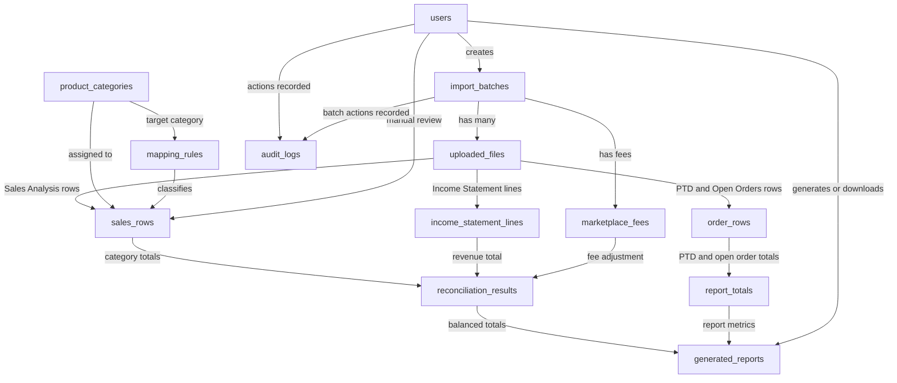

# Database Data Flow

This document shows how data moves through the Weekly Sales Analysis database.

## Main Flow

## Table Responsibilities

### User And Batch Setup

- `users`: stores application users and roles such as `admin` or `analyst`.
- `import_batches`: represents one weekly analysis run, usually tied to a week-ending date.
- `uploaded_files`: stores metadata for each uploaded workbook in a batch, including original name, private storage path, checksum, sheet names, and validation status.

### Imported Workbook Rows

- `sales_rows`: stores normalized rows from the Sales Analysis workbook. The current schema stores `item_id` and `description` directly on each row.
- `order_rows`: stores rows from PTD Orders and Open Orders workbooks. It also stores `item_id` and `description` directly on each row.
- `income_statement_lines`: stores imported Income Statement account/revenue lines.

### Classification

- `product_categories`: stores report categories such as RHP, Parts, T/S, Misc, and report row labels.
- `mapping_rules`: stores configurable matching rules. These rules classify `sales_rows` by fields like `item_id`, `description`, `customer_name`, or `sales_rep_id`.
- `sales_rows.product_category_id`: points to the category chosen by a mapping rule or manual review.
- `sales_rows.mapping_rule_id`: records which rule matched the row.
- `sales_rows.classification_status`: tracks `unmatched`, `matched`, or `manual`.

### Reconciliation

- `marketplace_fees`: stores Amazon/Walmart or other marketplace fee adjustments for an import batch.
- `reconciliation_results`: stores Sales Analysis totals, Income Statement totals, marketplace fee totals, adjusted totals, difference, balance status, and category totals.
- `report_totals`: stores calculated report metrics such as PTD Orders and Open Orders by period.

### Exports And Auditing

- `generated_reports`: stores metadata for generated Excel outputs, including report type, status, private storage path, checksum, summary, and errors.
- `audit_logs`: stores important user actions such as mapping edits, classification, reconciliation, report generation, and downloads.

## Weekly Process

1. A user creates an `import_batches` record for a week.
2. The six weekly Excel workbooks are stored in `uploaded_files`.
3. Workbook parsers create rows in `sales_rows`, `order_rows`, and `income_statement_lines`.
4. `mapping_rules` classify `sales_rows` into `product_categories`.
5. Unmatched rows are manually reviewed and updated.
6. Marketplace fees are added to `marketplace_fees`.
7. Reconciliation calculates totals into `reconciliation_results` and `report_totals`.
8. Excel exports are created and tracked in `generated_reports`.
9. Important actions are recorded in `audit_logs`.
