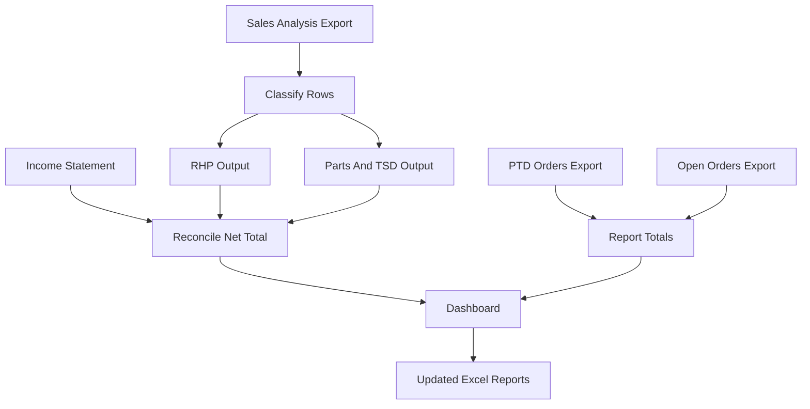

# Weekly Sales Analysis Automation Plan

## Scope
- Initialize a new Laravel application in the empty repository at `c:\laragon\www\weekly-sales-analysis` with React powered by Vite.
- Use MySQL for persistent uploads, import batches, normalized sales/order rows, reconciliation results, report totals, and configurable product/category mapping rules.
- Generate both dashboard views and updated Excel workbooks that preserve the provided report-template structure.
- Keep all frontend styling in [`resources/css/app.css`](resources/css/app.css); React components will use classes only, with no inline CSS.

## Observed Workbook Flow
The sample files show this weekly pipeline:

Key sample details:
- `04-17-2026 Sales Analysis (1).Xlsx` contains `Sheet` raw data plus organized `04-17-26 RHP` and `Parts & TSD` tabs.
- `Income Statement.xls.xlsx` stores revenue lines and the total revenue amount used for reconciliation.
- `Total Sales Report 2026.xlsx` and `Weekly Meter Report 2026.xlsx` are monthly template reports with week columns and formula-heavy totals.
- `PTD Orders.Xlsx` and `Open Orders.Xlsx` feed monthly PTD/open order values in the Total Sales Report.

## Backend Architecture
- Create domain-oriented Laravel modules under [`app/Domain/WeeklyAnalysis`](app/Domain/WeeklyAnalysis) to keep SOLID boundaries clear:
  - Import services parse each workbook type.
  - Classifier services apply configurable mapping rules.
  - Reconciliation services compare Sales Analysis totals against Income Statement values and marketplace fee adjustments.
  - Report builder services prepare Total Sales and Weekly Meter outputs.
  - Export services write updated Excel files from templates.
- Add controllers under [`app/Http/Controllers/Api`](app/Http/Controllers/Api) only as thin request/response layers.
- Add form requests under [`app/Http/Requests`](app/Http/Requests) for upload validation, mapping rule validation, and marketplace fee inputs.
- Add migrations for import batches, uploaded files, sales rows, order rows, marketplace fees, mapping rules, reconciliation results, generated reports, and audit logs.

## Frontend Architecture
- Build React pages/components under [`resources/js`](resources/js):
  - Upload weekly workbook set.
  - Review parsed file status and validation errors.
  - Manage configurable mapping rules for item IDs, descriptions, and report rows.
  - Review unmatched rows before finalizing a week.
  - Reconciliation dashboard showing Sales Analysis, Income Statement, marketplace fee adjustments, difference, PTD Orders, and Open Orders.
  - Download generated organized Sales Analysis, Total Sales Report, and Weekly Meter Report outputs.
- Add shared UI classes in [`resources/css/app.css`](resources/css/app.css), grouped by layout, forms, tables, alerts, buttons, and report summaries.

## Security Plan
- Use Laravel authentication and session/CSRF protection for the React SPA.
- Store uploaded spreadsheets outside the public web root and expose downloads only through authorized controller actions.
- Validate file type, extension, MIME type, size, expected workbook sheets, and required headers before importing.
- Escape spreadsheet-bound text and guard against formula injection when exporting user/imported values.
- Add role-friendly authorization policies so admin-only actions, like editing mapping rules, are isolated from regular weekly processing.
- Add rate limiting on upload/report routes and audit key actions such as uploads, mapping edits, reconciliation approvals, and report downloads.

## Testing Plan
- Add feature tests for upload validation, import batch creation, reconciliation success/failure, mapping rule management, and report export authorization.
- Add unit tests for workbook parsers, classification rules, marketplace fee adjustments, PTD/Open Orders aggregation, and Excel formula-injection escaping.
- Use the provided sample workbooks as local/manual verification fixtures, while keeping production-sensitive files out of git.

## Implementation Notes
- Prefer `phpoffice/phpspreadsheet` directly for precise template-preserving reads/writes and formula-aware exports.
- Seed initial configurable mapping rules from the sample workbook categories, but keep them editable in the app so future item IDs do not require code changes.
- Preserve existing workbook formulas where practical and write only the week/category cells required for each generated report.
